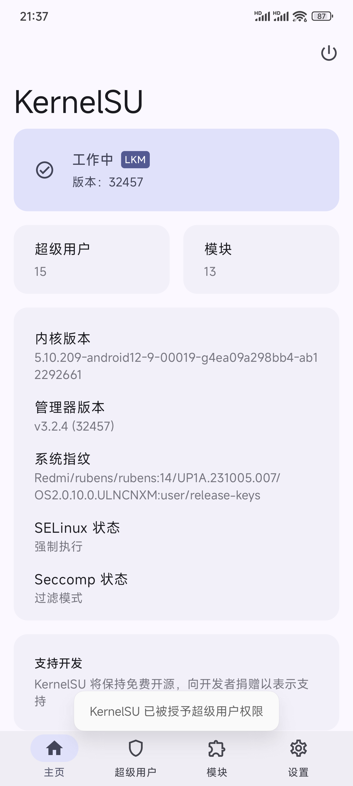
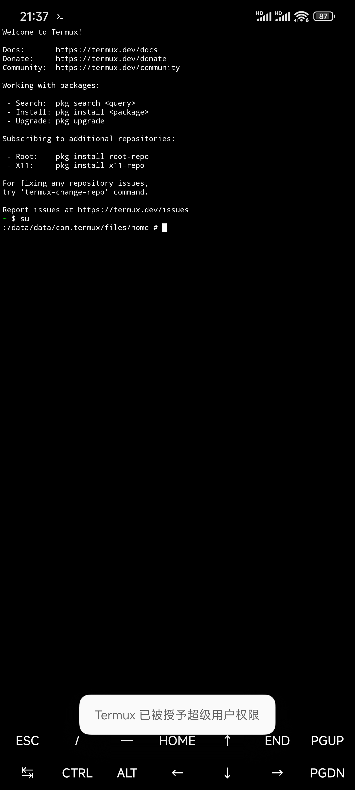

# KernelSU Grant Toast
##### 让KernelSU像Magisk一样弹出'授予超级用户权限' Toast
### 截图

### 安装
在Release中下载模块包后进入KernelSU中选中模块包安装即可

安装完成后需要重启生效 记得在重启前确保SuLog功能已启用

可以通过启动KernelSU管理器进行自测 如弹出授权Toast表示模块正常工作

该模块不依赖Zygisk和MetaModule
### 兼容性提醒
模块仅限最新(支持SuLog的版本)KernelSU使用 且仅在官方版本上测试

对其他分支版本兼容性未知 理论上如果未对SuLog功能进行修改就能正常工作
### 原理
KernelSU在开启SuLog功能后 会拉起一个常驻的ksud进程用于接收内核转发的日志数据并将其写入文件

该日志实时性极高 完全可以用作事件监测

安装模块后 当设备启动完成 模块将杀死原有负责日志写入的ksud进程并获取用于接收相关数据的文件描述符(该描述符只能被一个进程持有 故必须杀死ksud进程)接手事件处理

如果发现有Android应用被授予root权限 模块将获取该应用的相关信息 并在满足条件时弹出提醒
### 注意
由于原本负责写入日志文件的进程在设备启动完成后即被杀死 原本的SuLog将停止记录 你将无法在管理器中查看到设备启动后的SuLog数据

(理论上也可以通过监听日志文件变化来实现获取信息 但这么做性能可能不佳)

### 最后
感谢使用